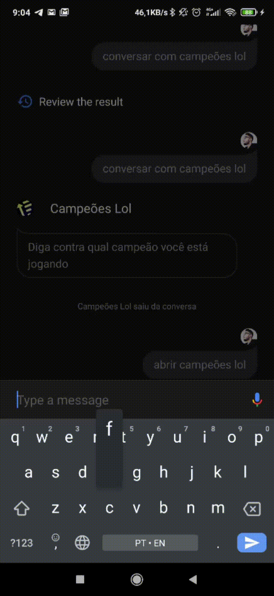

### Campeões Lol

Projeto desenvolvido com a finalidade de aprimorar conhecimentos em Javascript, Firebase e Golang

Inspirado pelo projeto [Dota App](https://github.com/alvarowolfx/gcloud-dota-app) do [Alvaro Viebrantz](https://github.com/alvarowolfx)

  

#### Exemplos de consulta da API disponibilizada

##### Consulta por campeão

[Ekko](https://champions-lol-rank-api-rnvhj74dhq-uc.a.run.app/champion/ekko)

> https://champions-lol-rank-api-rnvhj74dhq-uc.a.run.app/champion/{championId}

##### Exemplo de recomendação por campeão

[Graves](https://champions-lol-rank-api-rnvhj74dhq-uc.a.run.app/recommend/Graves)

> https://champions-lol-rank-api-rnvhj74dhq-uc.a.run.app/recommend/{championId}
